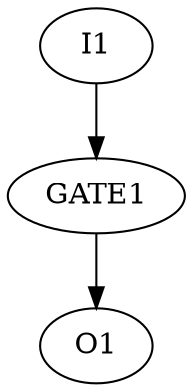

# Logic Gate Simulator

This project is a logic gate simulator capable of reading DOT-format circuit descriptions and JSON-format input signals. It simulates the behavior of digital circuits and produces output in a JSON format compatible with [WaveDrom](https://wavedrom.com/), a waveform rendering tool. Based on input provided in JSON format, the simulator can perform clock cycle iterations, including implicit delta cycles that are not directly visible.

---

## Features 

- Simulate logic circuits using standard logic gates (AND, OR, NOT, etc.)
- Supports MUX and Flip-Flop (`FF`)
- DOT-based circuit description with custom syntax
- JSON-based signal input/output format
- Output visualization using WaveDrom
- Comprehensive test suite

## Project Structure

```bash
├── src/                   # Source dir
│   └── Makefile/          # Makefile -> simulator
├── tests/                 # Example of DOT circuits / JSON waves
|   └── advanced_tests/    # More complex circuits including Flip FLops
|   └── basic_tests/       # simple gate used during development
|   └── examen_tests/      # Dir used to test the good behaviour of simulator
├── scripts/               # Util files & automatic test store inside 
```

## Input File Format
### **DOT** : 
Each file must start with a digraph declaration like that :


Some useful syntax notes : 
- Semicolon ; required at the end of each line
- Use spaces around arrows (->) to avoid syntax errors
- A loop-back gate (gate connected to itself) adds an extra input
- MUX gates accept multiple SEL parameters, in declaration order:
```dot
GATE1 [ LABEL = "MUX", SEL = "sel0", SEL = "sel1" ];
```
- Gate size (e.g., AND2) is automatically inferred by number of connections, not by label

Valid labels : 
```dot
INPUT, OUTPUT, NOT, AND, NAND, NOR, OR, XOR, MUX, FF
```

### **JSON INPUT** :

To run the simulator you must provide a JSON input file to set values for inputs. 
JSON file with signal definitions using 0, 1, and . (for undefined or unchanged):
Each values in wave correspond to a clock cycle.

```json
{ "name": "inputSignal1", "wave": "10.10101" }
```
> [!WARNING]
> Use double quotes (") only (no single quotes)

### **JSON OUTPUT** :

After execution a `output_simulator.json` will be provided containing the result values. The structure is the same and should be used in the waveform visualizer
```json
{ "name": "outputSignal1", "wave": "0...1..0..1" }
```

## How to run ? 
In order to compile the project, there is a `makefile` inside the `src` directory. Once runned, it will provide a simulator executable `simulator`

> [!WARNING]
> be sure to have at least g++ 11 version installed

To run a simulation two args neeeds to be path. The `dot` circuit and `input_signal`. 
```sh
./simulator "../input_circuit.dot" "../input_signal.json"
```
This will generate a `output_simulator.json` file.
> [!TIP]
> The DOT and JSON parser are capable to detect errors in order to avoid simulation error. This is very helpful to debug your code.

If you want to run the whole test suite after simulator modifications, it is possible by running a testsuite : 
```sh
./tests/examen_test_run.sh
```

For more complex circuit tests, you can start to look in `tests/advanced_tests` where you can find dot and json for those circuits : 

- Hald Adder
- Full Adder
- LFSR (Linear Feedback Shift Register)

## Know Test Exceptions :
Some specific testcase are skipped or not supported. Here is a list of the reported ones from the examen_test :

- `Mux_implicit.dot`      Not supported                           ❌
- `long_name_1&2.dot`	    Allowed                                 ✅
- `reserved_words.dot`	  Allowed                                 ✅ 
- `combo_loop_simple.dot`	Parity-sensitive; may vary              ⚠️ 
- `concatenation.dot`	    Two NOTs allowed                        ✅ 
- `floating_loop.dot`	    Uses only I/O; still works              ⚠️ 
- `xnor2.dot`	            Not implemented                         ❌ 
- `too_many_ports.dot`	  Handled dynamically by connection count ✅ 


